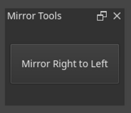

# Krita Mirror Tools

A simple Krita plugin that add a Docker button to symmetrize a layer.  
Work in Progress  
  
  
 
##  Install

**Manually**:
Extract everything inside the `pykrita` folder.

### Linux
~/.local/share/krita/pykrita/  
├── mirror_tools/  
└── mirror_tools.desktop  

### Windows
%APPDATA%\krita\pykrita\  
├── mirror_tools\  
└── mirror_tools.desktop  

Enable the plugin in **Settings > Configure Krita > Python Plugin Manager**.
